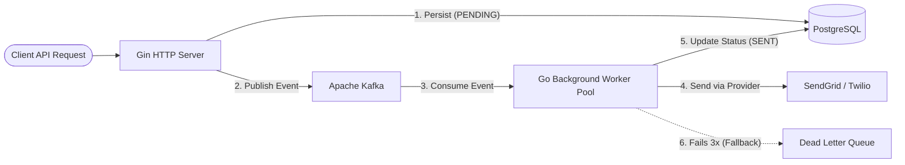

# 🚀 Enterprise Notification Service

[](https://golang.org/)
[](https://kafka.apache.org/)
[](https://www.postgresql.org/)
[]()
[](https://opensource.org/licenses/MIT)

A highly scalable, production-grade event-driven notification microservice written in Go. This service is designed to handle massive throughput by decoupling HTTP API requests from the inherently slow process of delivering network notifications (Email/SMS). 

By utilizing **Apache Kafka** as a central message broker and implementing a highly concurrent worker pool, this architecture guarantees **sub-20ms API response times**, **zero data loss**, and **extreme resilience** against third-party network outages.

---

## ✨ Project Highlights for Engineering Leaders

This project was built to demonstrate proficiency in enterprise backend engineering, focusing on reliability and scalability rather than just building a simple CRUD app.

*   **High Throughput & Concurrency:** Leverages Go's powerful concurrency model with a strict Channel-based Semaphore worker pool to process thousands of events simultaneously without suffering from Out-Of-Memory (OOM) crashes.
*   **Asynchronous Decoupling:** Replaces traditional blocking HTTP calls with a robust Kafka-driven event loop, allowing the API to scale independently of the notification providers.
*   **Fault Tolerance:** Implements exponential backoff retry mechanisms to automatically recover from temporary network failures (e.g., SendGrid/Twilio API timeouts).
*   **Zero Data Loss:** Architected with a Dead Letter Queue (DLQ). If a notification is truly unrecoverable (e.g., 401 Unauthorized), it is immediately safely isolated for DevOps auditing rather than silently dropping it.

---

## 🏗 System Architecture

The application runs as a unified binary containing two distinct systems running concurrently:

1. **HTTP API Server (Producer):** Receives high-velocity HTTP POST requests. It instantly persists the request state to PostgreSQL (`PENDING`), publishes the event payload to Kafka, and immediately responds to the client.
2. **Background Worker (Consumer-Producer):** A highly concurrent Goroutine pool that continuously consumes events from Kafka. It formats professional HTML templates and routes messages through SendGrid (Email) or Twilio (SMS). 



---

## 🛡 Production Resilience Patterns

This service implements several enterprise-grade architectural patterns to guarantee stability during peak traffic and network outages:

| Pattern | Implementation Details | Engineering Benefit |
| :--- | :--- | :--- |
| **Worker Pool (Semaphore)** | The Kafka Consumer is bound by a strict Go Channel semaphore (`max_workers=1000`). | **OOM Protection:** Guarantees the server will never exceed memory limits during extreme traffic spikes. |
| **Exponential Backoff** | Failed network requests trigger `avast/retry-go` logic, doubling the wait time between attempts. | **Network Resilience:** Survives temporary third-party API outages without dropping a single email. |
| **Dead Letter Queue (DLQ)** | If an email exhausts all retries, it is automatically routed to `notifications.events.dlq`. | **Observability:** Prevents poison-pills from blocking the queue while allowing DevOps to trigger PagerDuty alerts via Kafka Connect. |
| **Graceful Shutdown** | Captures `SIGINT/SIGTERM` and injects a cancellation `context.Context` into the worker pool. | **Data Integrity:** Allows active workers to finish their in-flight network requests before the application safely shuts down. |

### 🔄 Advanced Message Flow: Retries & Dead Letter Queue

The following sequence diagram illustrates exactly how the microservice handles catastrophic network failures:

```mermaid
sequenceDiagram
    participant Kafka as Kafka (Main)
    participant Worker as Background Worker
    participant Provider as SendGrid/Twilio
    participant DLQ as Kafka (DLQ Topic)
    participant Monitor as Kafka Connect / Slack

    Kafka->>Worker: Consume Event (ID: 105)
    
    rect rgb(20, 30, 40)
        Note right of Worker: Exponential Backoff Retry Loop
        Worker->>Provider: Attempt 1: Send Email
        Provider-->>Worker: ❌ HTTP 503 (Timeout)
        Note right of Worker: Wait 2s (Initial Backoff)
        
        Worker->>Provider: Attempt 2: Send Email
        Provider-->>Worker: ❌ HTTP 503 (Timeout)
        Note right of Worker: Wait 4s (Exponential Backoff)
        
        Worker->>Provider: Attempt 3: Send Email
        Provider-->>Worker: ❌ HTTP 503 (Timeout)
    end
    
    Note right of Worker: Max retries (3) exhausted
    Worker->>Worker: Update Database: status = 'FAILED'
    Worker->>DLQ: 📥 Publish Event to DLQ Topic
    
    Note over DLQ,Monitor: Automated Alerting Flow (DevOps)
    DLQ->>Monitor: Consume DLQ Event
    Monitor->>Monitor: 🚨 Trigger PagerDuty / Slack Alert
```



---

## 📂 Clean Architecture Layout

The codebase strictly adheres to **Clean Architecture / Domain-Driven Design (DDD)** principles to ensure high maintainability and testability.

```text
├── cmd/
│   └── api/main.go            # Application entrypoint & dependency injection
├── internal/
│   ├── api/router.go          # HTTP Routing (Gin)
│   ├── config/config.go       # Environment & YAML Configuration
│   ├── constants/             # Centralized application constants
│   ├── handler/               # HTTP Handlers (Controllers)
│   ├── model/                 # Domain Models & Database Schemas
│   ├── provider/              # External Integrations (SendGrid, Twilio)
│   ├── repository/            # Database Access Layer (GORM)
│   ├── service/               # Core Business Logic
│   └── worker/processor.go    # Background Kafka Consumer & Retry Logic
├── pkg/
│   ├── kafka/                 # Reusable Kafka Producer/Consumer abstractions
│   └── logger/                # Structured JSON Logger (Zap)
└── docker-compose.yml         # Local Infrastructure (PostgreSQL, Kafka, Zookeeper)
```

---

## 🛠 Tech Stack

*   **Core Language:** Go (Golang)
*   **Database ORM:** GORM
*   **Database Engine:** PostgreSQL 15
*   **Event Broker:** Apache Kafka (with Zookeeper)
*   **Web Framework:** Gin-Gonic
*   **Configuration:** Viper (YAML)
*   **Observability:** Uber Zap (Structured JSON Logging)
*   **Resilience:** Avast Retry-Go

---

## 🚀 Getting Started

### 1. Configure the Application
Ensure you have your SendGrid/Twilio API keys ready. Create a secure local configuration file:
```bash
cp config.yaml config.local.yaml
```
*Note: `config.yaml` is git-ignored to prevent credential leaking.*

### 2. Boot Infrastructure
Start the PostgreSQL database and Kafka/Zookeeper cluster via Docker:
```bash
docker-compose up -d
```

### 3. Run the Microservice
Start the Go application. This single command bootstraps the database migrations, HTTP API, and Background Worker:
```bash
go run cmd/api/main.go
```

---

## 🧪 Testing the Pipeline

Trigger the asynchronous workflow by sending a standard HTTP POST request. You will receive a `201 Created` response instantly (<20ms).

```bash
curl -X POST http://localhost:8080/api/v1/notifications \
-H "Content-Type: application/json" \
-d '{
    "type": "EMAIL",
    "recipient": "engineer@company.com",
    "content": "Welcome to the Event-Driven Architecture!"
}'
```

Watch the terminal closely to see the structured logging trace the event from the **HTTP Router** -> **Kafka** -> **Worker Pool** -> **SendGrid** -> **Database**!
