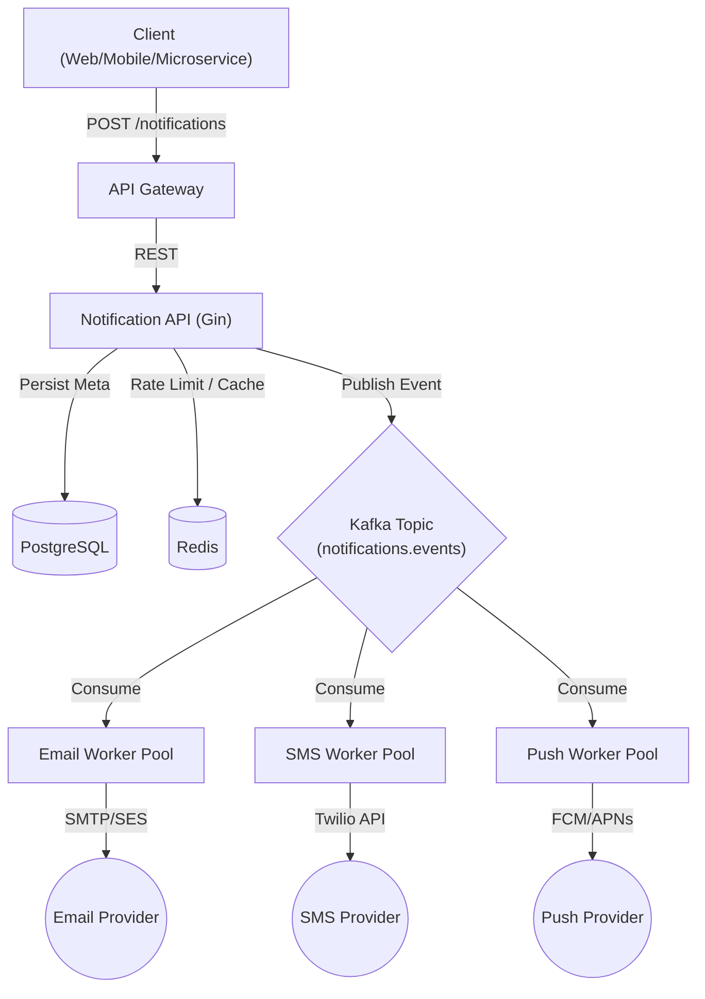

# 🚀 Notification Service (Production-Grade)


A high-throughput, horizontally scalable, event-driven Notification Service built in Go. Designed to handle millions of notifications reliably using Clean Architecture principles, asynchronous processing, and robust observability.

---

## 🏗️ System Architecture

The system decouples API ingestion from actual notification delivery to ensure sub-millisecond response times and high fault tolerance against third-party provider outages.



## ✨ Key Features

* **Event-Driven Asynchronous Delivery:** API instantly acknowledges requests and offloads delivery to Kafka consumers.
* **Resiliency & Retries:** Built-in exponential backoff, dead-letter queues (DLQ), and retry limits (default: 3) for failed deliveries.
* **Production Observability:** Structured JSON logging (Uber Zap), distributed tracing (OpenTelemetry), and Prometheus metrics ready.
* **Graceful Shutdown:** Configured with context timeouts to ensure no in-flight requests or database transactions are killed abruptly during deployments.
* **Clean Architecture:** Strict separation of concerns (Handler -> Service -> Repository) for maintainability and unit-testability.

---

## 🛠️ Tech Stack

| Category | Technology | Purpose |
| :--- | :--- | :--- |
| **Language** | Go (Golang) | High concurrency, fast execution, static typing. |
| **Framework** | Gin | High-performance HTTP web framework. |
| **Database** | PostgreSQL | ACID-compliant storage for notification metadata. |
| **ORM** | GORM | Database schema auto-migration and active-record interactions. |
| **Message Broker** | Apache Kafka | Durable, partitioned event streaming for worker queues. |
| **Configuration** | Viper | 12-Factor app configuration management (YAML/ENV). |
| **Logging** | Zap | High-performance, structured JSON logging. |
| **Infrastructure** | Docker Compose | Local reproducible infrastructure orchestration. |

---

## 📊 Database Schema

Our domain models are strictly typed and heavily indexed for fast querying on millions of rows.

```go
type Notification struct {
	ID          uint           `gorm:"primaryKey" json:"id"`
	Type        string         `gorm:"type:varchar(20);not null;index" json:"type"` // EMAIL, SMS, PUSH
	Recipient   string         `gorm:"type:varchar(255);not null;index" json:"recipient"`
	Content     string         `gorm:"type:text;not null" json:"content"`
	Status      string         `gorm:"type:varchar(20);not null;default:'PENDING';index" json:"status"`
	RetryCount  int            `gorm:"default:0" json:"retry_count"`
	ProviderID  string         `gorm:"type:varchar(255)" json:"provider_id,omitempty"`
	CreatedAt   time.Time      `json:"created_at"`
	UpdatedAt   time.Time      `json:"updated_at"`
	DeletedAt   gorm.DeletedAt `gorm:"index" json:"-"`
}
```

---

## 💻 Local Development Setup

### 1. Prerequisites
* **Go 1.24+** installed.
* **Docker & Docker Compose** installed.

### 2. Configuration
Ensure a `config.yaml` exists in the project root:
```yaml
server:
  port: 8080

database:
  host: "localhost"
  port: 5433
  user: "postgres"
  password: "password"
  dbname: "notification_db"

kafka:
  brokers:
    - "localhost:9092"
  topic: "notifications.events"
```

### 3. Spin Up Infrastructure
Start PostgreSQL, Zookeeper, and Kafka locally:
```bash
docker-compose up -d
```
*Verify containers are healthy via `docker ps`.*

### 4. Run the API Server
Download dependencies and start the API with Graceful Shutdown:
```bash
go mod download
go run cmd/api/main.go
```
*The server will auto-migrate the database schema upon startup.*

### 5. Health Check
```bash
curl http://localhost:8080/ping
# Response: {"message":"pong"}
```

---

## 📁 Project Structure

```text
notification-service/
├── cmd/
│   └── api/                 # Application entrypoint (main.go)
├── internal/
│   ├── config/              # Viper configuration loading
│   ├── handler/             # HTTP Controllers (Gin)
│   ├── service/             # Core Business Logic
│   ├── repository/          # Database & GORM interactions
│   ├── model/               # Domain Models & DB Schemas
│   ├── kafka/               # Kafka Producers
│   └── worker/              # Kafka Consumers / Delivery logic
├── pkg/
│   └── logger/              # Shared Utilities (Zap Logger)
├── config.yaml              # Environment configuration
├── docker-compose.yml       # Local infrastructure
└── go.mod                   # Dependencies
```
