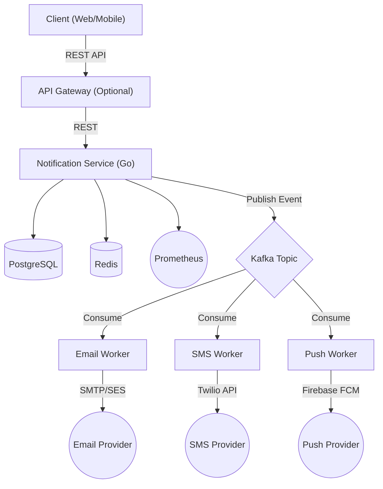

# Notification Service Architecture Blueprint

## Overview
A production-grade Notification Service designed as a distributed system capable of handling ~1 million notifications per day (average 11.6 req/sec, with spikes up to 200–1000 req/sec).

## System Architecture



### Core Workflow
1. **API Validation**: The API validates the incoming request.
2. **Database Persistence**: Saves the notification metadata to PostgreSQL.
3. **Event Publishing**: Publishes an event to Kafka.
4. **Worker Consumption**: Dedicated workers consume events and send notifications via respective providers.
5. **Status Update**: Workers update the notification status in the database upon success or failure.

*This decoupling of request handling from delivery improves resilience during provider outages and allows independent scaling of workers.*

## Tech Stack

### Core Technologies
*   **Language**: Go 1.24+
*   **HTTP Framework**: Gin (easy and popular) or Chi (more idiomatic)
*   **Database**: PostgreSQL
    *   *Usage*: Store notification metadata, delivery status, retry count, audit logs.
*   **Cache**: Redis
    *   *Usage*: Rate limiting, idempotency keys, OTPs (if needed), temporary status cache.
*   **Message Queue**: Kafka
    *   *Why*: High throughput, durable, consumer groups, retry support, partitioning. Industry standard.

### Communication
*   **External**: REST for clients
*   **Internal**: gRPC between internal services

### Observability & Configuration
*   **Logging**: Zap (Structured production logging. *Never rely on fmt.Println in production*).
*   **Configuration**: Viper, `.env` files.
*   **Metrics**: Prometheus & Grafana.
    *   *Track*: Notifications received/sent, failed deliveries, retry count, queue lag, processing latency.
*   **Tracing**: OpenTelemetry.

### Security & Documentation
*   **Authentication**: JWT for admin APIs.
*   **Documentation**: OpenAPI / Swagger.

### DevOps & Testing
*   **Containerization**: Docker & Docker Compose.
*   **Deployment**: Kubernetes (later phase), GitHub Actions for CI/CD.
*   **Testing**: Unit tests, Integration tests, Benchmark tests.

## Features

### REST API Endpoints
*   `POST /notifications` - Send a single notification
*   `POST /notifications/bulk` - Send bulk notifications
*   `GET /notifications/:id` - Check status of a notification
*   `GET /notifications` - List notifications (with pagination/filters)
*   `POST /schedule` - Schedule a notification for later
*   `POST /retry` - Manually retry a failed notification

### Notification Types
*   Email
*   SMS
*   Push (FCM/APNs)
*   Webhook

### Reliability & Concurrency Patterns
*   **Concurrency**: Goroutines, Worker Pools, Context cancellation, Graceful shutdown.
*   **Retry Strategy**: 3 retries, Exponential backoff, Dead Letter Queue (DLQ).
*   **Reliability Features**: Idempotency keys, Request IDs, Correlation IDs, Database transactions, Health/Readiness checks.

## Suggested Folder Structure

```text
notification-service/
├── cmd/
│   └── api/
├── internal/
│   ├── handler/         # HTTP/gRPC handlers
│   ├── service/         # Business logic
│   ├── repository/      # Database interactions
│   ├── worker/          # Kafka consumers/workers
│   ├── kafka/           # Kafka producer/client setup
│   ├── grpc/            # gRPC server/client setup
│   ├── middleware/      # Rate limiting, auth, logging
│   ├── config/          # Viper configuration setup
│   ├── model/           # Domain models
│   └── provider/        # 3rd party integrations
│       ├── email/
│       ├── sms/
│       └── push/
├── pkg/                 # Reusable public packages
├── proto/               # gRPC Protobuf definitions
├── migrations/          # SQL database migrations
├── docs/                # Swagger/OpenAPI docs
├── Dockerfile
├── docker-compose.yml
└── Makefile
```

## Learning Outcomes (Resume Value)
Building this project demonstrates proficiency in:
*   Go Concurrency & Clean Architecture
*   Distributed System Design
*   Kafka & Event-Driven Architecture
*   Redis (Caching, Rate Limiting)
*   PostgreSQL & Database Design
*   REST & gRPC APIs
*   Docker & Containerization
*   Prometheus, OpenTelemetry & Production Logging
*   Testing methodologies
